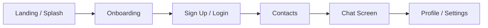
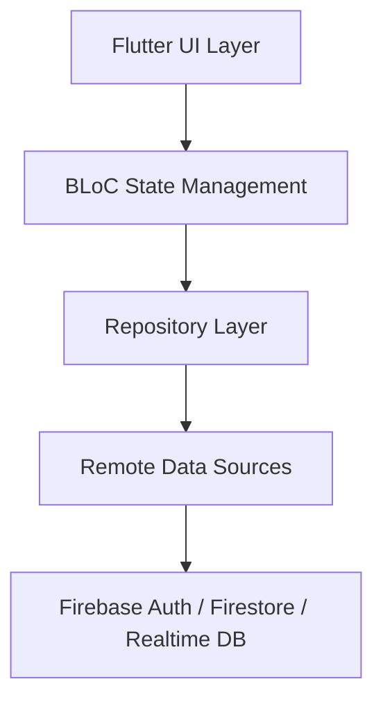

<div align="center">

# 🌙 Whisper

### A modern Flutter chat app with Firebase-powered communication and polished UX

[](https://flutter.dev)
[](https://dart.dev)
[](https://bloclibrary.dev)
[](https://firebase.google.com)

<table>
  <tr>
    <td align="center" bgcolor="#3F72AF">
      
    </td>
  </tr>
</table>

</div>

> Whisper is a sleek messaging experience designed for secure onboarding, real-time chat, and a clean mobile-first user interface.

---

## ✨ App Overview

Whisper is a chat application built with Flutter and Firebase, combining elegant UI design with a scalable clean-architecture structure. The app is focused on essential user flows such as onboarding, authentication, contact browsing, direct messaging, and profile management.

### Core user journey



### High-level architecture



---

## 🎯 Key Features

<table>
  <tr>
    <td align="center"><strong>🔐 Auth</strong><br/>Firebase login and signup</td>
    <td align="center"><strong>🧩 Onboarding</strong><br/>Smooth introduction flow</td>
    <td align="center"><strong>📇 Contacts</strong><br/>User selection and listing</td>
  </tr>
  <tr>
    <td align="center"><strong>💬 Messaging</strong><br/>Direct chat interface</td>
    <td align="center"><strong>⚙️ Settings</strong><br/>Profile and preferences</td>
    <td align="center"><strong>🔔 Notifications</strong><br/>FCM-ready helper integration</td>
  </tr>
</table>

- Firebase Authentication for secure sign-up and login
- Responsive onboarding flow with polished visuals
- Contact-focused chat experience
- Clean architecture separation between UI, data, and domain logic
- Modern mobile-first design with soft color styling and card-based layout

---

## 🛠️ Tech Stack

| Layer | Technology |
|---|---|
| App Framework | Flutter |
| Language | Dart |
| State Management | flutter_bloc |
| Architecture | Clean Architecture |
| Backend | Firebase Auth, Firestore, Realtime Database |
| API / Messaging | Firebase Cloud Messaging |
| Data Pattern | Repository + Remote Data Source |

---

## 🧱 Project Structure

```text
lib/
├── core/
│   ├── app_colors/
│   ├── app_images/
│   ├── app_routes/
│   ├── constants/
│   ├── failures/
│   ├── fcm_auth_helper/
│   ├── notification/
│   └── widgets/
├── features/
│   ├── spash/
│   ├── onboarding/
│   ├── login/
│   ├── sign_up/
│   ├── forgot/
│   ├── contacts/
│   ├── chat/
│   ├── setting/
│   └── presentation/
├── firebase_options.dart
├── main.dart
├── barrel.dart
└── ...
```

Each feature is organized into separate layers to keep the app easy to extend and maintain.

---

## 📱 Screen Experience

### Splash and onboarding
A branded splash screen introduces the app, followed by a guided onboarding experience with a clean, app-focused layout.

### Authentication
Users can:

- create an account
- log in with email and password
- recover an account through a forgot-password flow

### Contacts and messaging
Authenticated users can browse contacts, open conversations, and send direct messages through a simple chat view.

### Profile and settings
The settings area supports profile visibility, personalization, theme preference, and log out actions.

---

## 🚀 Getting Started

### Prerequisites

- [Flutter SDK](https://docs.flutter.dev/get-started/install)
- [Firebase project](https://firebase.google.com/)
- Android Studio / VS Code / Xcode for running the app

### Install dependencies

```bash
git clone https://github.com/Talhaarif326/whisper.git
cd whisper
flutter pub get
```

### Firebase setup

1. Create a Firebase project in the Firebase console.
2. Add the Android and/or iOS app to that project.
3. Download and add the required config files:
   - `google-services.json` for Android
   - `GoogleService-Info.plist` for iOS
4. Configure Firebase for Flutter:

```bash
flutterfire configure
```

5. Enable the required Firebase services:
   - Firebase Authentication
   - Firestore or Realtime Database
   - Firebase Cloud Messaging (if notifications are used)

### Run the app

```bash
flutter run
```

---

## 🔍 Notes

- This project is built as a mobile-first chat application with a clean architecture foundation.
- `firebase_options.dart` is generated by FlutterFire and should reflect your project configuration.
- Notification features require proper Firebase Cloud Messaging setup for the target platform.

---

## 👤 Author

**Talha Arif**

---

## 📄 License

This project is currently unlicensed.

<div align="center">

<sub>Built with 💙 in Flutter</sub>

</div>
