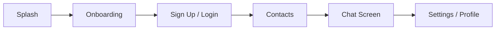

<div align="center">

# 🌙 Whisper

### A sleek Flutter chat app with Firebase-powered messaging and clean architecture

[](https://flutter.dev)
[](https://dart.dev)
[](https://bloclibrary.dev)
[](https://firebase.google.com)
[]()

<table>
  <tr>
    <td align="center" bgcolor="#3F72AF">
      
    </td>
  </tr>
</table>

</div>

> 🚀 Whisper is a modern messaging experience built for smooth onboarding, secure authentication, and direct conversations in a clean, polished Flutter UI.

---

## ✨ Overview

Whisper is a feature-rich chat application designed to feel lightweight, modern, and easy to extend. The project combines:

- Clean architecture layers for maintainable code
- Firebase authentication for login and sign up
- Contact-based messaging flow
- BLoC state management for predictable UI behavior
- A refined mobile-first design with rounded surfaces and modern cards

The current user flow is:

**Splash → Onboarding → Sign Up / Login → Contacts → Chat → Settings / Profile**

---

## 🌟 App Experience

### Core flow



### Included features

- 🔐 User authentication with Firebase
- 🧩 Swipeable onboarding experience
- 👤 Sign up, login, and forgot-password flow
- 📇 Contact list with user selection
- 💬 Direct messaging interface
- ⚙️ Profile and settings management
- 🧠 Feature-first Clean Architecture with BLoC

---

## 🛠️ Tech Stack

| Layer | Technology |
|---|---|
| UI | Flutter |
| Language | Dart |
| State Management | flutter_bloc |
| Architecture | Clean Architecture |
| Backend | Firebase Auth, Realtime Database, and Firestore |
| Data Flow | Repository and Remote Data Source pattern |

---

## 🏗️ Project Structure

```text
lib/
├── core/
│   ├── app_colors/
│   ├── app_routes/
│   ├── app_images/
│   ├── constants/
│   ├── failures/
│   └── widgets/
├── features/
│   ├── spash/
│   ├── onboarding/
│   ├── login/
│   ├── sign_up/
│   ├── forgot/
│   ├── contacts/
│   ├── chat/
│   ├── setting/
│   └── presentation/
├── firebase_options.dart
├── main.dart
├── barrel.dart
└── ...
```

Each feature keeps its data, domain, and presentation responsibilities organized so the application can grow without coupling UI code to backend implementation details.

---

## 📱 App Screens

### Splash and onboarding

A branded splash screen introduces the app, followed by a multi-step onboarding experience with illustrations and navigation controls.

### Authentication

Users can:

- Create an account with name, email, and password
- Log in with email and password
- Request a password reset link

### Contacts and chat

Authenticated users can browse contacts, select a conversation, view messages, and send new messages from the dedicated chat screen.

### Settings and profile

The settings area displays profile information, provides profile editing access, includes a notification toggle, and supports logout.

---

## 🎨 Design Direction

Whisper uses a clean mobile-first visual language:

- rounded containers and cards
- elevated chat bubbles and surfaces
- clear contrast and readable typography
- soft blue-focused color palette
- consistent spacing and reusable components

---

## 🚀 Getting Started

### Prerequisites

- [Flutter SDK](https://docs.flutter.dev/get-started/install)
- Dart SDK, bundled with Flutter
- Android Studio, VS Code, or Xcode
- A Firebase project configured for the application

### Install and run

```bash
# Clone the repository
git clone https://github.com/Talhaarif326/whisper.git
cd whisper

# Install dependencies
flutter pub get

# Run the application
flutter run
```

### Firebase setup

1. Create a Firebase project.
2. Add the Android and/or iOS application.
3. Configure Firebase for the selected platform.
4. Enable Firebase Authentication and the required database services.
5. Run the application on a connected device or emulator.

---

## 🔍 Future Ideas

The architecture leaves room for additional features such as:

- real-time typing indicators
- user presence status
- media and file sharing
- improved message persistence
- theme switching
- push notifications

---

## 👤 Author

<div align="center">

**Talha Arif**  
Flutter Developer

</div>

---

## 📄 License

This project is currently unlicensed. All rights reserved by the author.

<div align="center">

<sub>Built with 💙 in Flutter</sub>

</div>
